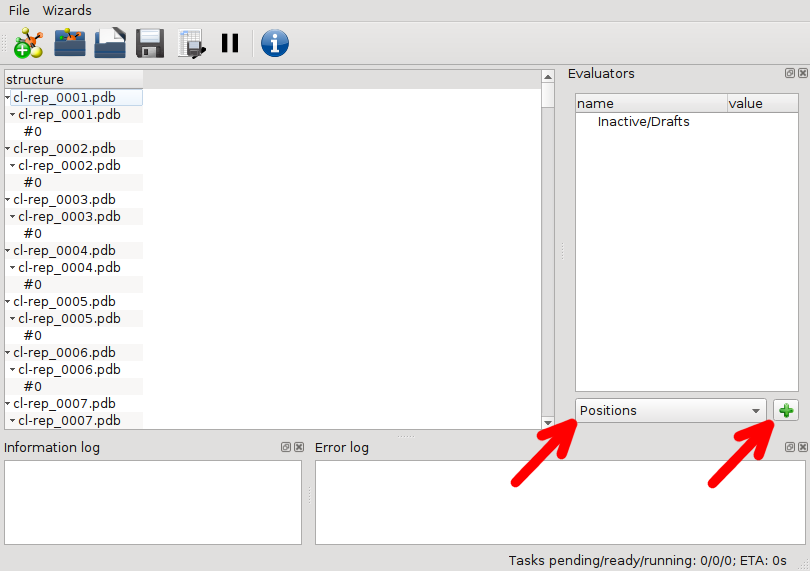
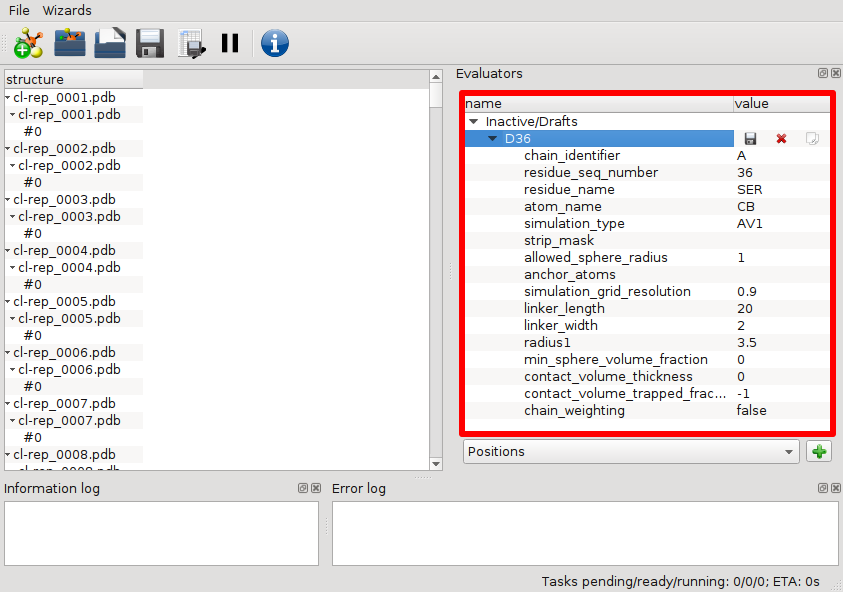
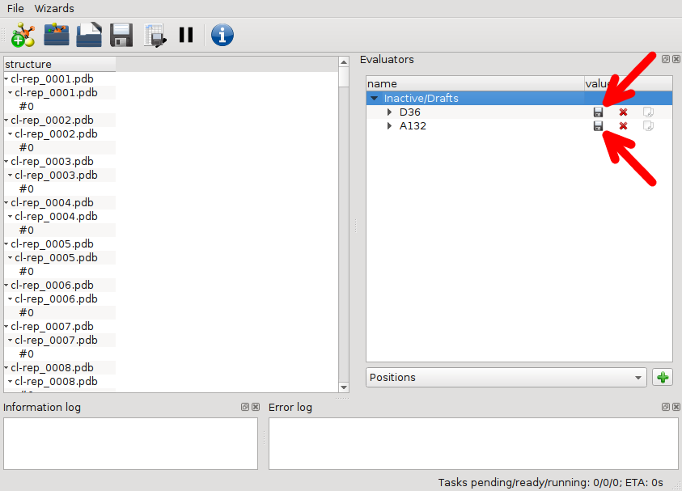
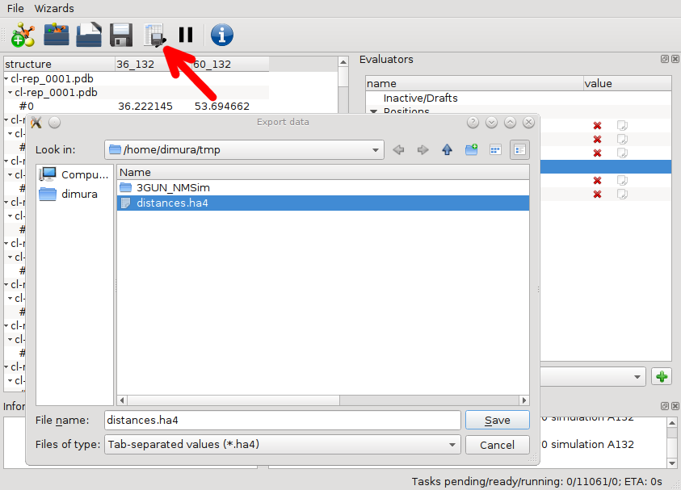

# Tutorial: screening of structural models and generation of accessible volumes
## Screening
1. Start Olga software
2. Press "Import structures" button to load a set of PDB files. Select the files that you need to screen, use shift/ctrl buttons to select multiple files.

3. Create a labelling position evaluator. To do this, you need to select "Position" from the dropdown menu and then press "+" button.

New labelling position will appear in the evaluators panel. Unfold it to see its settings.

4. Now Labelling Position properties can be filled out. First one has to choose the simulation type (here AV1 is selected). In this example Donor label is shown, GFP is used as a dye (radius1 = 20 Angstrom). It is attached by linker consisting of 62 aminoacids, therefore linker length at maximum extension is defined as linker_legth = 62 * 3.7 + 20 = 249.4, where 3.7 is the length of a single amino acid and 20 is the effective radius of the GFP. Here linker width of 7 Angstrom is used, digitization step is set to 2 Angstrom (simulation_grid_resolution = 2). You will need to specify chain id, residue id, residue name and atom name of the atom, to which fluorophore linker is attached. User can specify allowed_sphere_radius option, which tells algorithm to ignore obstacles in the given radius in AV simulation. Since in this example the dye (GFP) is attached to the protein by a peptide linker, chain_weighting option is activated to account for the polypeptide chain dynamics. This option reweights the probability density distribution within the AV as described by ... The name of the labelling position can be changed by double-clicking on the corresponding field (here "A:ALA1088").

5. Copy the Donor labelling position and modify the copy to represent the Acceptor.

6. Activate Donor and Acceptor labelling position drafts by pressing "save" button.

7. Create a distance evaluator. To do this select "Distance" from dropdown menu and press "+", as in step 3.
8. Select the distance type, donor and acceptor labelling position, specify the Förster radius. If available, you can specify the measured distance and error.

9. Save the distance evaluator to start calculation. Once the distance evaluator is saved, a corresponding column will appear next to the structure list. At first this column will only show "...". Once the corresponding calculation is finished, calculated distance value will show up (or "nan" if the distance could not be calculated).

10. Results table can be saved by pressing "Export calculated values" button.

## Saving the Accessible Volume files
1. Create "AV file" evaluator.

2. Select the labelling position, format (openDX or .xyz) and directory to save the files (write_dir). If write_dir is empty, directory of the PDB file is used. Once the AV File evaluator is saved, program will automatically simulate AVs and save AV clouds for each of the loaded PDBs.

3. AV cloud files can be now found in the write_dir. In this example .dx format is used. Here Pymol software is used to view the resulting cloud.

