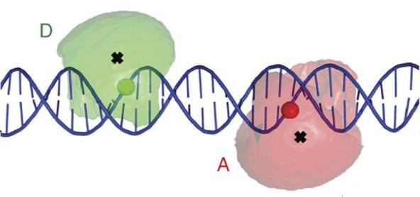
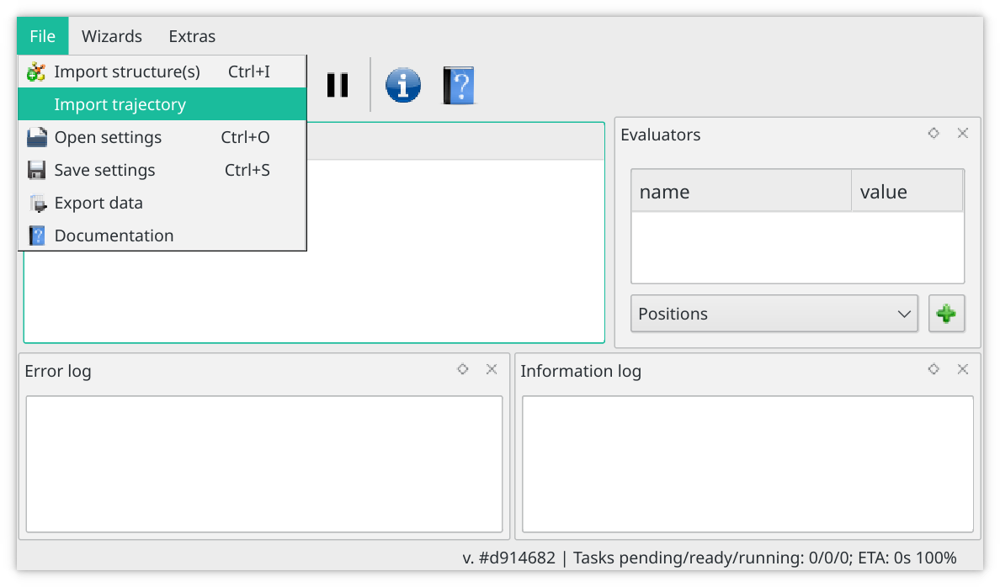
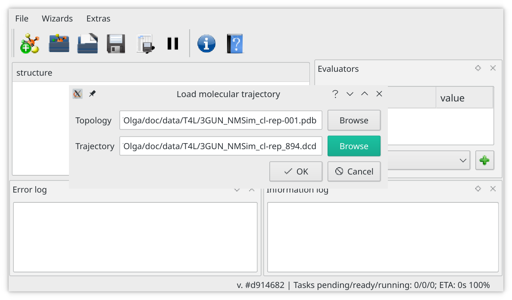

# Tutorial: FRET screening of structural models
## Summary
In this tutorial we walk through the calculation of FRET-average inter-dye distances for the case when organic dyes are used, i.e. Alexa 488 as a donor and Alexa 647 as an Acceptor. We use T4 lysozyme (T4L) protein as an example. The tutorial consists of 10 steps:

1. Start the software
2. Load an ensemble of conformations
3. Create a donor label
4. Configure the linker and dye parameters for the donor label
5. Create and configure the acceptor label
6. Activate Donor and Acceptor labels
7. Create a FRET distance evaluator
8. Configure the FRET distance evaluator
9. View results
10. Save results

Additional information is available in the [article by Kalinin et al](https://doi.org/10.1038/nmeth.2222):
> Kalinin S, Peulen T, Sindbert S, Rothwell PJ, Berger S, Restle T, Goody RS, Gohlke H, Seidel CA. A toolkit and benchmark study for FRET-restrained high-precision structural modeling. Nature methods. 2012 Dec;9(12):1218.

## Screening

1. Start Olga software (`Olga.exe` executable).

2. Choose "Import trajectory" menu item to load a trajectory. Select the trajectory and topology files you need to screen. In this example we use a [trajectory](../data/T4L/3GUN_NMSim_cl-rep_894.dcd) and the corresponding [topology](../data/T4L/3GUN_NMSim_cl-rep-001.pdb), which contains structural models of T4L protein generated by [NMSim](http://nmsim.de/) software from the 3GUN crystal structure. The trajectory was clustered using RMSD as the distance metric and a threshold of 1.8 Angstrom. 

   
   

3. In this example we are calculating FRET-average distance between the dyes attached to residue #36 (SER, donor) and #132 (ASN, acceptor). First, we create a labelling position evaluator for the donor. Select "Position" option from the dropdown menu, then press the "+" button.

   

  New labelling position will appear in the evaluators panel. Unfold it to see its settings.
  

4. Now Labelling Position properties can be filled out. First one has to choose the simulation type (here AV1 is selected). In this example Donor label is shown, Alexa 488 is used as a dye. Chromophore moiety approximated by a sphere with the radius of 3.5 Angstrom (`radius1 = 3.5`). It's linker has length of 20 Angstrom at maximum extension (`linker_length = 20`). We use linker width of 2 Angstrom; digitization step is set to 0.9 Angstrom (`simulation_grid_resolution = 0.9`). You will need to specify chain ID (`chain_identifier = A`), residue ID (`residue_seq_number = 36`), residue name (`residue_name = SER`) and name of the atom, to which fluorophore linker is attached. In experiment, typically, labelled residue is mutated to cysteine and then the dye is covalently bound to it by maleimide linker. To mimic that, we use Cβ atom as the attachment point (`atom_name = CB`). User can specify `allowed_sphere_radius` option, which tells algorithm to ignore obstacles in the given radius in AV simulation. For example, side chain atoms would not exist in experiment, but they are present in the PDB files and can be disregarded for AV simulations.
We can rename evaluator from default `new LP`  to, e.g. `D36` by double-clicking on its name.

   

5. Copy the Donor labelling position and modify the copy to represent the Acceptor. We rename the copy to `A132`. We increase linker length to 22 Angstrom, since acceptor linker is longer in this case. We also adjust residue name (`residue_name = ASN`) and residue id (`residue_seq_number = 132`).

   

6. Activate Donor and Acceptor labelling position drafts by pressing "save" button.

   

7. Create a distance evaluator. To do this select "Distance" from dropdown menu and press "+", as in step 3.

8. First we select the `distance_type`, possible options are:
 * `RDAMean` - average inter-dye distance, typically obtained from TCSPC-like analysis.
 * `RDAMeanE` - FRET-average inter-dye distance, typically obtained from single molecule / PDA analysis.
 * `Rmp` - distance between mean positions of accessible volumes, usually can not be directly obtained from FRET experiments.

  Then we pick donor (`position1_name = D36`) and acceptor(`position2_name = A132`) labelling position, specify the Förster radius (`Forster_radius = 52`). If available, measured distance and error can be specified, otherwise default values can stay. Rename and save the distance evaluator to start calculation.
   

9. Once the distance evaluator is saved, corresponding column will appear next to the structure list. At first this column will only show `...`. Once the corresponding calculation is finished, calculated distance value will show up (or "nan" if the distance could not be calculated). Repeat steps 7-9 to calculate multiple FRET distances.

   

10. Results table can be saved by pressing "Export calculated values" button.
      

## Saving the Accessible Volume (AV) files
1. Create the "AV file" evaluator. In dropdown menu select `AV File` and press `+`. New evaluator will appear in `AV File` section of the "Evaluators" panel.
   

2. Select the labelling position (`position_name = D36`), and directory to save the files (`write_dir`). If `write_dir` is empty, directory of the PDB file is used. Once the AV File evaluator is saved, program will automatically simulate AVs and save AV clouds for each of the loaded PDBs. By default `.pqr` format is used to save AV files, it can be changed to `openDX` by setting `openDX = true`.
   

3. AV cloud files can be now found in the `write_dir`. Here Pymol software is used to view the resulting cloud.
   
